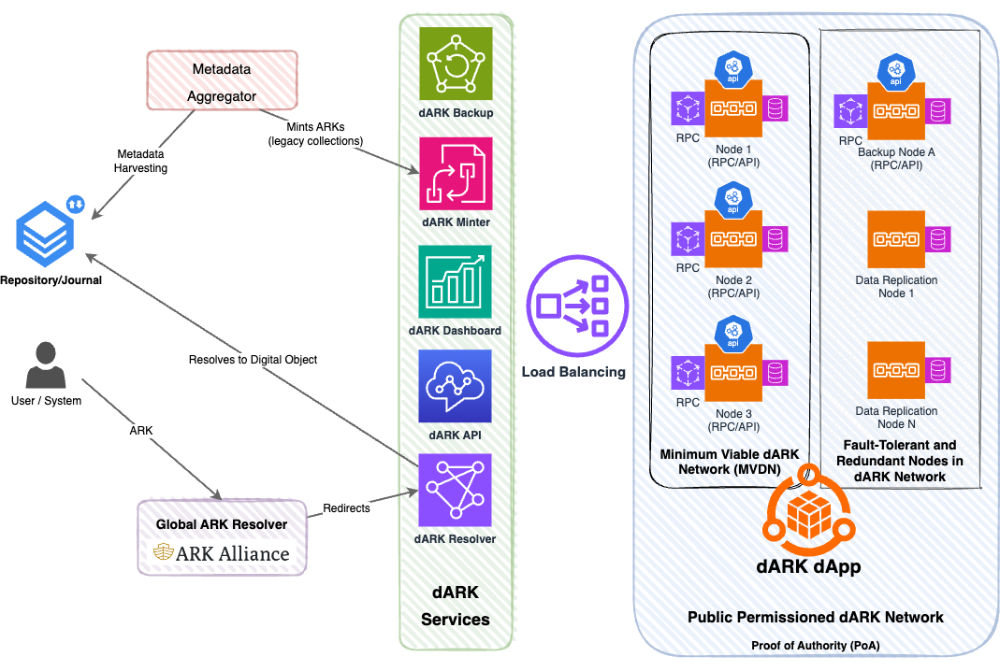

# dARK Core Layer
dARK (Decentralized Archival Resource Key) is a blockchain-based implementation of the [ARK](https://arks.org/) (Archival Resource Key) identifier scheme.  It provides a decentralized approach to managing ARK identifiers, enhancing their persistence, immutability, and availability.  dARK is *not* a new PID system; it is an extension and decentralized implementation of the existing ARK standard.

Further detail of our project see our whitepaper [](https://doi.org/10.5281/zenodo.7442743).

This document explains the on-chain (the code thats execute within a blockchain) architecture of dARK, components, and mechanisms of the dARK system.
<!-- no toc -->
- [dARK Core Layer](#dark-core-layer)
  - [The On-Chain Foundation](#the-on-chain-foundation)
  - [dARK Overview](#dark-overview)
    - [Technologies](#technologies)
  - [Deployment and Configuration](#deployment-and-configuration)
    - [System Requirements](#system-requirements)
    - [Deployment Steps](#deployment-steps)
  - [Interacting with dARK: Libraries, Resolvers, and APIs](#interacting-with-dark-libraries-resolvers-and-apis)
    - [dARK Python Library](#dark-python-library)
    - [dARK Resolver](#dark-resolver)
    - [dARK Minter API](#dark-minter-api)
  - [dARK Technical Documentation \& Architure](#dark-technical-documentation--architure)

## The On-Chain Foundation

The dARK Core Layer is the heart of the dARK system, representing the on-chain blockchain application that enables multiple organizations to interact securely and independently.  This repository focuses *exclusively* on this Core Layer – the smart contracts and associated logic that run directly on the blockchain.

**Key Properties of the dARK Core Layer:**

*   **Decentralized and Fault-Tolerant:** The Core Layer is built on a blockchain network (specifically, Hyperledger Besu in the reference implementation).  This means that the data and application logic are replicated across multiple nodes, making the system highly resistant to failure.  Even if *all* the machines within a single participating organization go offline, the dARK system continues to operate, ensuring the long-term preservation of identifiers and metadata.
*   **Secure and Auditable:** All interactions with the Core Layer are secured by the cryptographic mechanisms of the blockchain.  Every operation (minting an ARK, updating metadata, etc.) is recorded as a transaction, providing a complete and immutable audit trail. This ensures the integrity and trustworthiness of the data.
*   **Independent Operation:** Each participating organization maintains its own nodes on the blockchain network. This allows them to interact with the system independently, without relying on a central authority.
*   **Smart Contract Based:** The core logic of dARK is implemented as smart contracts (written in Solidity). These contracts define the rules for minting ARKs, managing metadata, and handling permissions.
*   **On-Chain Data:** Stores the data on-chain.

**Multiple Blockchain Networks (Flexibility):**

The dARK architecture allows for the creation of multiple, independent blockchain networks. This is illustrated in the diagram below:




The dARK system, as illustrated in the diagram, is structured in layers: the the Service Layer, and the Core Layer. The Service Layer includes additional services that interact with the Core Layer; for instance, a `dARK Resolver` integrated with the global [nt2.info](http://n2t.info) resolver or the `dARK Minter` (Hyperdrive) employed to mint new PIDs. Note that HyperDrive or Resolver is not part of this specific repository but is shown for overall architectural context.

The Core Layer, which is the primary focus of this repository, demonstrates the possibility of multiple, independent blockchain networks. These networks, can be managed by their corresponding authorities. Each network comprises the underlying blockchain technology (like Hyperledger Besu) for decentralized ledger and smart contract execution, and optionally, IPFS (InterPlanetary File System) for decentralized off-chain storage of larger metadata payloads (not implemented yet), with their hashes stored on-chain for verification. While this repository concentrates on the on-chain aspects, the potential role of IPFS is important to acknowledge. 


<!-- **Diagram Explanation:**

*   **dARK Governance Layer:** This layer represents the organizational structure and agreements between participating institutions. Different authorities (e.g., Brazilian Authority, Latam Authority, UE Authority) can manage their respective blockchain networks.
*   **dARK Service Layer:** This layer represents additional services that interact with the Core Layer. Examples include a "Quality Service" (for data quality checks) and "HyperDrive" (which is *not* applicable to this specific repository, as noted in previous sections, but is shown here for completeness of the overall dARK architecture).
*   **dARK Core Layer:** This is the focus of this repository. It shows multiple, independent blockchain networks:
    *   **Brazilian dARK Net:** A blockchain network managed by the Brazilian Authority.
    *   **Latam dARK Net:** A blockchain network managed by the Latam Authority.
    *   **UE dARK Net:** A blockchain network managed by the UE Authority.
    *   Each network consists of:
        *   **Blockchain:** The underlying blockchain technology (e.g., Hyperledger Besu) that provides the decentralized ledger and smart contract execution.
        *   **IPFS:** (InterPlanetary File System - *Optional, but often used with blockchains*) A decentralized storage system that can be used to store larger metadata payloads off-chain, while their hashes are stored on-chain for verification. This repository's code primarily deals with the *on-chain* aspects, but it's important to understand the potential role of IPFS.
*   **Users:** Different organizations (represented by `br_org_1`, `ar_org_1`, etc.) interact with their respective blockchain networks. -->

**Focus of this Repository:**

This repository contains the code and configuration for the *on-chain* components of the dARK Core Layer. This includes:

*   **Solidity smart contracts:** Defining the rules for ARK minting, metadata management, and permissions.
*   **Deployment scripts:** For deploying the smart contracts to a blockchain network.
*   **Configuration files:** For setting up the connection to a specific blockchain network and configuring the NOID service.
*   **Python Library:** For interacting with the on-chain components.

It *does not* include the code for:

*   The dARK Governance Layer (organizational agreements).
*   The dARK Service Layer (external services like "Quality Service").
*   Off-chain storage systems (like IPFS).
*   User interface components.
*   The minter API.
*   The resolver.

The key takeaway is that the dARK Core Layer, as implemented in this repository, provides a robust and flexible foundation for building decentralized ARK identifier systems. Different organizations can collaborate by joining existing networks or creating their own, all while maintaining the security and immutability benefits of blockchain technology. The use of smart contracts ensures that the rules of the system are enforced consistently and transparently.


## dARK Overview


dARK extends the well know ARK system to a decentralized environment, leveraging blockchain technology. The on-chain part of dARK is responsible for the following core functionalities:

*   **Identifier Registration:** The creation of new ARK IDs is performed through blockchain transactions, ensuring the uniqueness and immutability of the identifiers. The process involves interaction with the on-chain service (e.g., NOID the Authority service), which verify the requester's (curator's) permission and generate the unique identifier.
*   **Metadata Storage:** The metadata associated with each dARK ID (such as `external_pids`, `external_links`, etc) is stored in a decentralized and secure manner on the blockchain. While larger payloads can be stored off-chain, the essential metadata and hashes of the payloads reside on-chain.
*   **Identifier Resolution:** Resolving a dARK ID to its corresponding metadata is done through queries to the blockchain. The system uses a routing structures and service to access the data efficiently.
*   **Auditing :** All on-chain operations are secured by cryptographic mechanisms of the blockchain. Blockchain wallets are used to authenticate curators, and the system verifies if they have the necessary permissions to perform operations. The complete transaction history is stored immutably, providing a full audit trail.
*   **Indexing and Query Services:** On-chain indexing databases store information such as external URLs, and external PIDs, enabling efficient queries and integration with other PID systems.
*   **Proof of Existence:** The blockchain provides proof of existence for all metadata and identifiers through timestamps and hashes.

### Technologies

The on-chain implementation of dARK uses the following technologies:

*   **Hyperledger Besu:** An open-source Ethereum client implementation designed for private and consortium networks. This allows the creation of a permissioned blockchain network, controlled by the participating institutions.
*   **Smart Contracts (Solidity):** The logic of dARK is implemented in smart contracts written in the Solidity language (implicit, but crucial for the on-chain part).
*   **Ethereum Virtual Machine (EVM):** The smart contracts are executed on the EVM, ensuring deterministic and secure execution of operations.

## Deployment and Configuration

This section guides you through the deployment and configuration process for dARK. After completing these steps, your dARK system will be ready for use.

### System Requirements

Before you begin, ensure your system meets the following requirements:
*   Python 3.10
*   pip (Python package installer)
*   Docker
*   Docker Compose

### Deployment Steps

Follow these steps to deploy and configure dARK:
<!-- no toc -->
1. [Install requirements](#1-install-requirements)
2. [Setup dARK](#2-setup-dark)
3. [Deploy and Configure dARK on the Blockchain](#3-deploy-and-configure-dark-on-the-blockchain)

#### 1. Install Requirements

First, create and activate a Python virtual environment:

```sh
python3 -m venv web3
source web3/bin/activate
```

Then, install the required Python packages:

```bash
pip install -r requirements.txt 
```


#### 2. Setup dARK

dARK uses three _ini_ files for configuration, all located in the project's root directory:

*   **`config.ini` (from `example_config.ini`):** Contains general settings, blockchain network parameters, and smart contract configurations. This is your primary configuration file.
*   **`noid_provider_config.ini` (from `example_noid_provider_config.ini`):** Configures the NOID (Nice Opaque Identifier) service, responsible for generating unique identifiers.
*   **`deployed_contracts.ini` (generated automatically):** Stores the addresses of the deployed smart contracts on the blockchain. This file is created during the deployment process.

For detailed explanations of the parameters within each configuration file, refer to the [configuration files documentation](docs/configuration_files.md).

1.  **Rename and Configure `config.ini`:**
    Copy `example_config.ini` to `config.ini` in the project's root directory:

    ```bash
    cp example_config.ini config.ini
    ```

    Edit `config.ini` to adjust settings as needed. The default parameters in `config.ini` are designed for use with the [dark-local](docs/configuration_files.md) environment running locally.  If you are using a different setup (e.g., a different blockchain network, custom node configuration), update the relevant sections accordingly as detailed, [here](docs/configuration_files.md).

2.  **Rename and Configure `noid_provider_config.ini`:**
    Copy `example_noid_provider_config.ini` to `noid_provider_config.ini`:

    ```bash
    cp example_noid_provider_config.ini noid_provider_config.ini
    ```
    Edit `noid_provider_config.ini` as needed.

#### 3. Deploy and Configure dARK on the Blockchain

This repository provides Python scripts to simplify the deployment and configuration process:

*   **`configure.py`:**  Performs initial setup and configuration of the dARK services and databases *on the blockchain* after the contracts have been deployed.  It uses the settings in `config.ini` and `noid_provider_config.ini`.
*   **`deploy.py`:** Compiles and deploys the dARK smart contracts to the specified blockchain network.  It uses the settings in `config.ini`.
*   **`clean.py`:**  Removes temporary files and artifacts created during the deployment process.

For detailed explanations of the parameters within each configuration file, refer to the [Configuration Files Documentation](docs/configuration_files.md).

1.  **Deploy Smart Contracts:**
    Execute the `deploy.py` script to compile and deploy the smart contracts to your configured blockchain network:

    ```bash
    python deploy.py  # Use python.exe on Windows if needed
    ```
    This step creates the `deployed_contracts.ini` file, storing the contract addresses.

2.  **Configure dARK Services:**
    Run the `configure.py` script to set up the dARK services and databases on the blockchain:

    ```bash
    python configure.py  # Use python.exe on Windows if needed
    ```

    This script uses the configurations in `config.ini` and `noid_provider_config.ini` to initialize the on-chain components of dARK.

Once these steps are complete, **your dARK instance will be fully deployed and configured, ready to mint and manage persistent identifiers!**


## Interacting with dARK: Libraries, Resolvers, and APIs

This section provides an overview of how to interact with the dARK system, whether you're using a public dARK, consortium, or your own locally deployed instance.  It covers the available tools and their roles, linking to relevant repositories.

1. [dARK Python Library](#dark-python-library) : Direct Blockchain Interaction
2. [dARK Resolver](#dark-resolver) : Resolving ARK Identifiers
3. [dARK Minter API](#dark-minter-api) : Simplified ARK Minting


### dARK Python Library

The [dARK Python Library](https://github.com/dark-pid/dark-gateway) provides a convenient, low-level way to interact directly with the dARK smart contracts from your Python applications.  This library works regardless of whether you're connecting to a public dARK network, a consortium network, or your own local/organizational deployment. It allows you to:

*   **Mint new ARK identifiers:** Register new resources and obtain their corresponding ARK IDs.
*   **Resolve ARK identifiers:** Retrieve the metadata associated with a given ARK ID.
*   **Manage metadata:** (If supported by your dARK instance) Update or extend the metadata of existing ARK IDs.
*   **Query the blockchain:** Access on-chain information, such as checking for the existence of an ARK ID, retrieving the owner of an ARK, and listing associated external PIDs.

The repository contains detailed documentation, installation instructions, and usage examples.  It's the recommended approach for developers building applications that need fine-grained control over dARK interactions or that need to integrate directly with the blockchain logic.  To connect to your own instance, you'll configure the library using your instance's (`config.ini` and `deployed_contracts.ini`) files, specifying the appropriate blockchain network and contract addresses.

### dARK Resolver

The dARK system utilizes a resolver to translate ARK identifiers into the location of the identified resource or its associated metadata.  The resolver acts as a central point of access for resolving ARKs.

*   **Public/Consortium Resolvers:**  A dARK instance may be integrated with larger resolving systems, such as [n2t.net](https://n2t.net/).  In this case, you can use standard ARK resolution URLs, like:

    ```bash
    curl https://n2t.net/ark:/your-naan/your-ark-id
    ```

*   **Local/Organizational Resolvers:**  You can also deploy your own resolver instance for local testing or within a private network.  The [dARK Resolver repository](https://github.com/dark-pid/dark-resolver) provides instructions for setting up a local resolver.  You would then use your resolver's URL instead of `n2t.net`.  For example:

    ```bash
    curl http://localhost:8000/ark:/your-naan/your-ark-id  # Example local resolver URL
    ```

Regardless of which resolver you use, the process is the same: the resolver receives the ARK ID, queries the appropriate dARK blockchain (based on the NAAN), and returns the metadata or a redirect to the resource.

### dARK Minter API

The [dARK Minter API](https://github.com/dark-pid/hyperdrive) provides a simplified, RESTful interface for minting ARK identifiers.  It's designed for use by repository software (like DSpace, OJS, Dataverse, etc.) and other applications that need to obtain persistent identifiers *without* directly interacting with the blockchain.  You can deploy your own instance of the Minter API, or you might use a shared instance provided by a dARK consortium.

The Minter API acts as an intermediary, abstracting away the complexities of blockchain interaction. It offers a simple HTTP-based API, typically with a `/mint` endpoint for creating new ARKs.

**Key Features:**

*   **RESTful API:** Uses standard HTTP methods (POST, GET, etc.) and JSON.
*   **Simplified Minting:** Single endpoint for requesting new ARKs.
*   **Metadata Validation:** Validates metadata against a predefined schema.
*   **Authentication:** Supports authentication (e.g., API keys).
*   **Rate Limiting:** Includes rate limiting to prevent abuse.
*   **Abstraction:** Hides blockchain complexities.
*   **Idempotency (Optional but Recommended):** Prevents duplicate ARKs.
*   **Integration with dARK Python Library:** Uses the dARK Python Library internally.

The Minter API repository provides documentation on the available endpoints, request/response formats, and any required authentication.  If you're integrating a repository system with dARK, the Minter API is the recommended approach.  To use your own instance, you would deploy the Minter API and configure your repository software to use its URL.

## dARK Technical Documentation & Architure

The [technical documentation](./docs/technical_overview.md) file provides a deep dive into the technical architecture of the dARK system.  It serves as a comprehensive reference for developers, administrators, and anyone who wants to understand the inner workings of dARK. The file includes:

*   **Introduction to dARK:**  A high-level overview of the dARK system, its purpose, and its relationship to the ARK identifier scheme.
*   **Core Components and Data Models:** A detailed explanation of the fundamental building blocks of dARK, including:
    *   **Persistent Identifier (PID)** 
    *   **Decentralized Name Mapping Authority (DNMA)** 
    * **NOID provider**
*   **dARK Key Processes:**  Illustrations and explanations of the core workflows within dARK, such as `PID Creation Process` and `PID Resolution Process`.
*   **Smart Contract Details and Architecture:** A thorough description of each smart contract in the dARK system,
 with secevral diagram visually representing the relationships and dependencies between the various smart contracts to provide a high-level overview of the system's structure.

In summary, [technical documentation](./docs/technical_overview.md)is the go-to resource for a complete technical understanding of the dARK system's on-chain implementation,to provide a comprehensive and explanation of dARK's inner workings.
