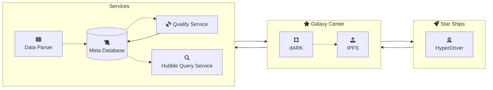
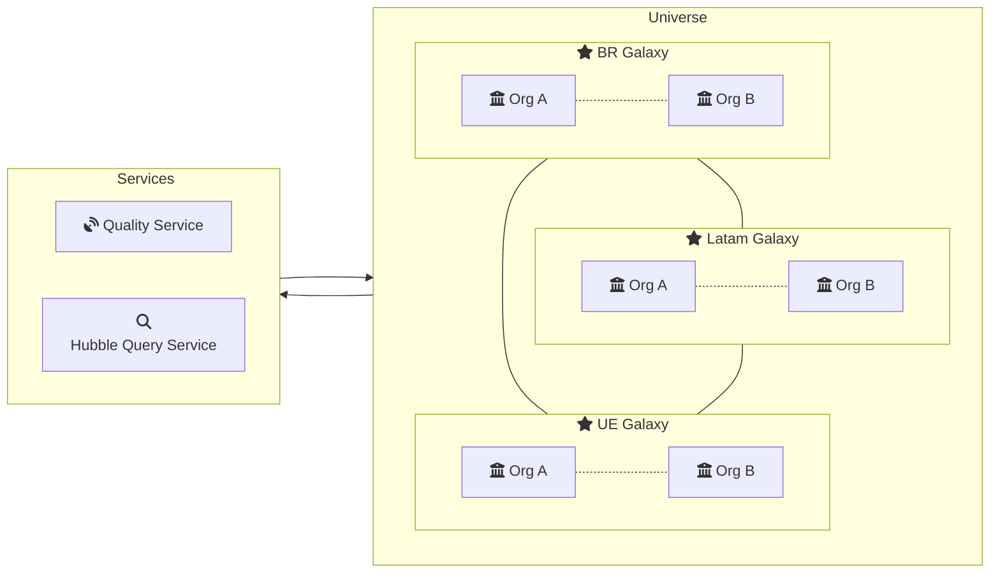

# dARK Documentation

This folder contains the dARK Project Documents

**Documentarion Tools**

The documentation was build usin the visual studio code and and the [mermaid markup languege](https://mermaid.live). We also use the following extensions.

> [Visual Studio Draw.io Integration](https://marketplace.visualstudio.com/items?itemName=hediet.vscode-drawio)
> 
>[Markdown Preview Mermaid Support](https://marketplace.visualstudio.com/items?itemName=bierner.markdown-mermaid)

# dARK Overview

The dARK has three majors components

## Galaxy Center

Description here

### PID Desing

dARK is based on the ARK PID system. Due to the decentralized capalities of the dARK it has unique characteristic. This characteristic are detailed in the [PID Desing](./dARK_pid/) documents.

### Blockchain Desing
TODO

## Star Ships

Description here

## Galaxy Satellites (Services)

Description here

# dARK Universe

