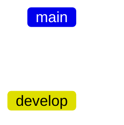
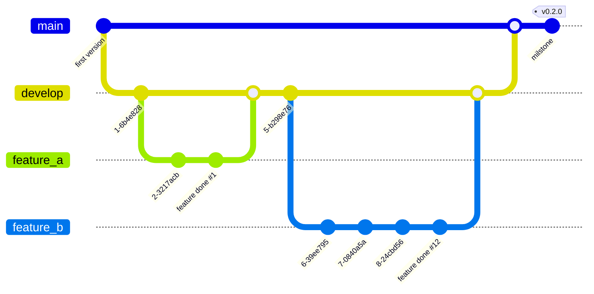

# Contribution Guide

>> Table of Content
>> 1. [Code of Conduct](#code-of-conduct)
>> 1. [Handling Issues](#project-issues)
>> 1. [How to use git](#using-git-flow-for-development)

This document intendes to guides contributors to their first contribution. It helps new contributors find a project they want to work with, learn about that project, and then find a task that is suitable to their skills and interests and not already assigned to someone else.

## Code of Conduct
This code of conduct outlines expectations for participation in dARK open source communities. We are committed to providing a welcoming and inspiring community for all. Examples of behavior that contributes to a positive environment for our community include:

- Demonstrating empathy and kindness toward other people
- Being respectful of differing opinions, viewpoints, and experiences
- Giving and gracefully accepting constructive feedback
- Accepting responsibility and apologizing to those affected by our mistakes, and learning from the experience
- Focusing on what is best not just for us as individuals, but for the overall community

## Project Issues

This section describes how to report and track issues related to the dARK project.

### Open an Issue

If you encounter a bug, have a feature request, or have a question about the dARK project, please open an issue on the [GitHub repository](https://github.com/dark-pid/dark).  Before opening a new issue, please:

1.  **Search existing issues:** Check if the issue has already been reported.  If it has, you can add a comment to the existing issue to provide additional information or indicate that you are also experiencing the problem.
2.  **Use the correct repository:** Ensure you are opening the issue in the correct repository (e.g., the main dARK repository, the Python library repository, the Minter API repository, etc.).

When opening a new issue, please provide the following information:

*   **Clear and descriptive title:**  Summarize the issue concisely.
*   **Detailed description:** Explain the issue in detail, including:
    *   **Steps to reproduce:**  Provide clear, step-by-step instructions on how to reproduce the bug (if applicable).
    *   **Expected behavior:** Describe what you expected to happen.
    *   **Actual behavior:** Describe what actually happened.
    *   **Error messages:** Include any error messages you received.
    *   **Screenshots:** If applicable, include screenshots to illustrate the issue.
    *   **Environment:** Specify your operating system, Python version, browser (if applicable), and any other relevant environment details.
    *   **Configuration:** If the issue is related to configuration, specify which files you modified and the relevant values.
*   **Labels:** Use appropriate labels to categorize the issue (e.g., "bug," "feature request," "question," "documentation").

### Resolving an Issue

This section will be updated with information on how issues are resolved within the dARK project. This will likely involve:

*   **Triage:**  A project maintainer will review the issue, verify its validity, and assign appropriate labels and priority.
*   **Assignment:** The issue may be assigned to a specific developer.
*   **Discussion:** There may be further discussion on the issue to clarify details or propose solutions.
*   **Development:** A developer will work on a fix or implement the requested feature.
*   **Pull Request:** The developer will submit a pull request with the proposed changes.
*   **Review:** The pull request will be reviewed by other developers.
*   **Testing:** The changes will be tested to ensure they resolve the issue and do not introduce new problems.
*   **Merge:** Once the pull request is approved and tested, it will be merged into the main codebase.
*   **Closure:** The issue will be closed, indicating that it has been resolved.

This provides a good starting point for your "Project Issues" section. The "Resolving an Issue" part is a placeholder, but it outlines the typical steps in an issue resolution workflow. You'll need to fill in the specifics based on your project's actual processes. The important things are to encourage clear and detailed issue reports and to provide a basic framework for how issues are handled.


## Using Git Flow for development

For this project we recoment the use of *Git Flow*. Git flow is a popular branching model that provides guidelines for managing branches in a Git repository. It's designed to help teams collaborate on larger projects while maintaining an organized branching strategy. This guide will explain how to use Git Flow to manage the `develop` and `main` branches in GitHub project.


### Branch Overview

- `main` Branch: This branch represents your production-ready code. It should always contain stable, release-ready code that has been thoroughly tested.

- `develop` Branch: This is your main development branch. It acts as the integration branch for new features and bug fixes before they're ready for release.




### Workflow

1. Developers create feature branches based on `develop`.
2. After completing a feature, a pull request is made to merge the feature branch into `develop`.
3. Prepare for releases by creating a release branch, stabilizing and testing the code, and merging it into both `main` and `develop`.
4. Handle hotfixes similarly to releases: create a hotfix branch, fix the issue, and merge into both `main` and `develop`.

### Merging

- Merging feature branches into `develop` ensures new code is integrated and tested together.
- Merging release branches into both `main` and `develop` preserves stable releases in both branches.

### Activating the git flow in the project repository

Before cloning the project repository use the command (in your development machine) below to enable the repository.

```sh
git flow init
```

Answer the question using the deaulf values. As demonstrated in the box below:

> ```
> Which branch should be used for bringing forth production releases?
>    - main
> Branch name for production releases: [main] 
> Branch name for "next release" development: [develop] 
>
> How to name your supporting branch prefixes?
> Feature branches? [feature/] 
> Bugfix branches? [bugfix/] 
> Release branches? [release/] 
> Hotfix branches? [hotfix/] 
> Support branches? [support/] 
> Version tag prefix? [] 
> Hooks and filters directory? [D:/workspace/<<your_project_name>>/.git/hooks] 
> ```

Now the git flow is activated and can be used.

## Using git flow to address the issues

In this example we have two features - _features_a_ (issue #1) and _feature_b_ (issue #12)- to be implemented in a release (`0.2.0`). The diagram 



## Feature Branches

- To add a new feature, create a feature branch off the `develop` branch.
- Naming convention: `feature/short-description`.

Considering the git graph, to create the feature_a the developer will use the following command to create a branch:

```sh
git flow feature start short-description-of-feat-a
```

The command above will automaticaly create a branch (named as _short-description-of-feat-a_) from the develop branch. The developer will implement all functions and methods in this branch. When the feature is ready the developer will `merge` the short-description-of-feat-a to the `develop` branch by using the following command:

```sh
git flow feature finish short-description-of-feat-a
```

This command will merge all code of the `short-description-of-feat-a` to the `develop`.


## Maing Branch Management

This actions will be performed by the Project PO. 

### Release Branches

- When preparing for a release, create a release branch off the `develop` branch.
- This branch allows for code stabilization and testing before merging into `main`.
- Naming convention: `release/version-number`.

### Hotfix Branches

- For critical issues in the production code, create a hotfix branch off the `main` branch.
- This branch enables quick fixes without affecting ongoing development.
- Naming convention: `hotfix/short-description`.


### Tagging

- After merging a release or hotfix, consider adding a tag to the `main` branch to mark the release version.

Remember, while Git Flow provides a structured approach, adapt it to your team's needs. The main goal is to maintain a clear distinction between stable production-ready code (`main`) and ongoing development (`develop`), while using feature branches to isolate changes.