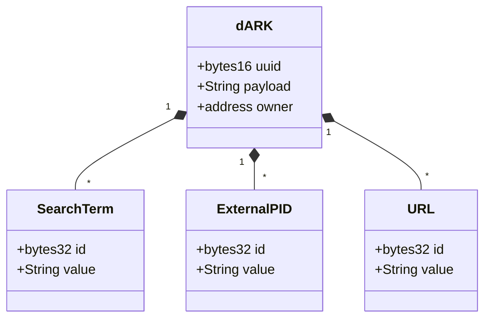

# dARK PID Desing Documentation

dARK is based on ARK... 

TODO: improve description

# Important Points

Need to be detailed : 

- Specify dARK Objects (e.g., authors/publication)
- metadata structure
- metadata data storage (ipfs?)

# dARK Diagrams

## Class Diagram

