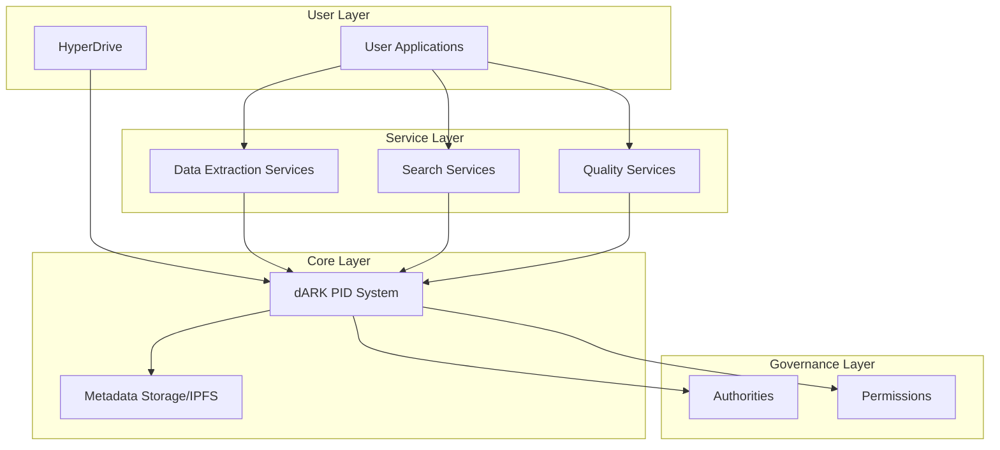
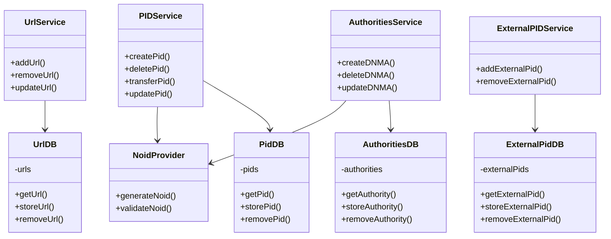
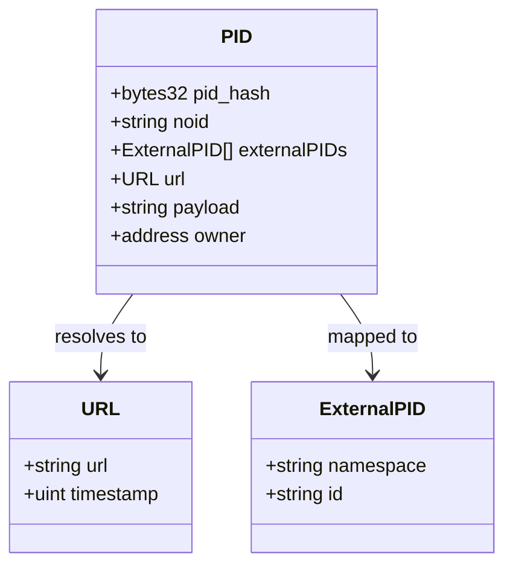
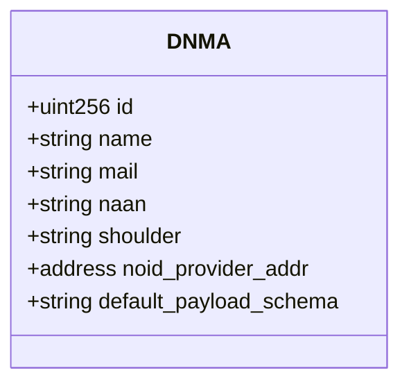
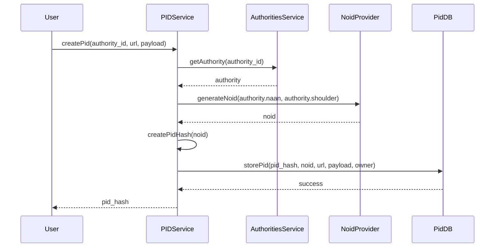
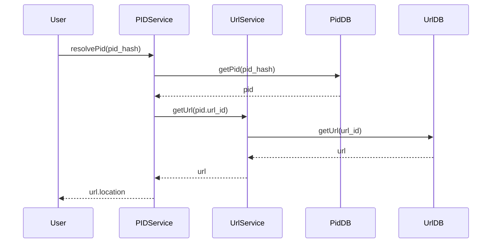

# dARK: Decentralized ARK System

## Introduction

dARK (decentralized ARK) is a blockchain-based implementation of ARK Persistent Identifiers (PIDs). It provides a decentralized approach to managing persistent identifiers for digital objects, ensuring they remain stable even when the underlying resources change location or ownership.

This document explains the architecture, components, and mechanisms of the dARK system.

## Architecture Overview

The dARK system is structured in a layered architecture that separates concerns and provides clear boundaries between different functional areas.



### Layer Descriptions

1. **Governance Layer**: Manages authorities and permissions
   - Controls who can create and manage PIDs
   - Defines the authority structure for the system

2. **Core Layer**: 
   - dARK PID System: Central identifier management
   - Metadata Storage (IPFS): Distributed storage for PID metadata

3. **Service Layer**: 
   - Data Extraction Services: Extract information from identified resources
   - Search Services: Find PIDs and resources
   - Quality Services: Ensure data quality and integrity

4. **User Layer**: 
   - HyperDrive: Main interface for PID management
   - Other applications that consume PIDs

## Smart Contract Architecture

The dARK system is implemented as a set of interacting smart contracts on the blockchain.



## Core Components and Data Models

### 1. Persistent Identifier (PID)

The central entity in the system is the Persistent Identifier (PID).



### 2. Decentralized Name Mapping Authority (DNMA)

Authorities that can issue PIDs within the system.



### 3. NOID (Nice Opaque Identifier)

The system uses NOID specification for generating identifiers:

```
[naan]/[shoulder][identifier][check digit]
```

For example: `12345/x4gp8q6s`

Where:
- `12345`: NAAN (Name Assigning Authority Number)
- `x`: Shoulder (prefix used for a specific identifier pool)
- `4gp8q6`: Identifier
- `s`: Check digit for validation

## Key Processes

### 1. PID Creation Process



### 2. PID Resolution Process



## Smart Contract Details

### Services

#### 1. PIDService.sol

This service manages the creation, updating, deletion, and resolution of PIDs.

Key functions:
- `createPid(authority_id, url, payload)`: Creates a new PID
- `updatePid(pid_hash, url, payload)`: Updates an existing PID
- `deletePid(pid_hash)`: Removes a PID
- `transferPid(pid_hash, new_owner)`: Transfers ownership
- `resolvePid(pid_hash)`: Resolves a PID to its URL

#### 2. UrlService.sol

Manages URLs associated with PIDs.

Key functions:
- `addUrl(pid_hash, url)`: Adds a URL to a PID
- `updateUrl(pid_hash, url_id, new_url)`: Updates a URL
- `removeUrl(pid_hash, url_id)`: Removes a URL

#### 3. ExternalPIDService.sol

Handles mappings between dARK PIDs and external PID systems (DOI, ORCID, etc.)

Key functions:
- `addExternalPid(pid_hash, namespace, id)`: Maps external PID to dARK PID
- `removeExternalPid(pid_hash, ext_pid_id)`: Removes mapping

#### 4. AuthoritiesService.sol

Manages the authorities that can issue PIDs.

Key functions:
- `createDNMA(name, mail, naan, shoulder, noid_provider)`: Creates authority
- `updateDNMA(id, name, mail, naan, shoulder, noid_provider)`: Updates authority
- `deleteDNMA(id)`: Removes authority

### Database Contracts

#### 1. PidDB.sol

Stores PID data.

Key functions:
- `storePid(pid_hash, noid, url, payload, owner)`
- `getPid(pid_hash)`
- `removePid(pid_hash)`

#### 2. UrlDB.sol

Stores URL data.

Key functions:
- `storeUrl(url)`
- `getUrl(url_id)`
- `removeUrl(url_id)`

#### 3. ExternalPidDB.sol

Stores external PID mappings.

Key functions:
- `storeExternalPid(pid_hash, namespace, id)`
- `getExternalPid(ext_pid_id)`
- `removeExternalPid(ext_pid_id)`

#### 4. AuthoritiesDB.sol

Stores authority data.

Key functions:
- `storeAuthority(name, mail, naan, shoulder, noid_provider)`
- `getAuthority(id)`
- `removeAuthority(id)`

### Utility Contracts

#### 1. NoidProvider.sol

Generates NOID identifiers according to the NOID specification.

Key functions:
- `generateNoid(naan, shoulder)`: Creates a new NOID
- `validateNoid(noid)`: Validates a NOID using its check digit

#### 2. UUIDProvider.sol

Alternative identifier provider using UUIDs.

#### 3. Entities.sol

Defines the data structures used throughout the system.

## Deployment and Configuration

The system uses Python scripts for deployment and configuration:

1. `configure.py`: Sets up the initial configuration
2. `deploy.py`: Deploys the smart contracts to the blockchain
3. `clean.py`: Cleans up deployment artifacts

Configuration is stored in INI files:
- `example_config.ini`: General configuration
- `example_deployed_contracts.ini`: Deployed contract addresses
- `example_noid_provider_config.ini`: NOID provider configuration

## Use Cases

### 1. Academic Resource Identification

Researchers can create persistent identifiers for academic resources that remain stable even if the resource changes location.

### 2. Cross-System Integration

The ability to map external PIDs (like DOIs) to dARK PIDs enables integration with existing academic systems.

### 3. Decentralized Authority Management

Different organizations can be authorized as DNMAs to issue PIDs within their domains, creating a federated approach to PID management.

## Conclusion

The dARK system provides a robust, decentralized approach to persistent identifier management. By leveraging blockchain technology, it ensures the persistence and integrity of identifiers while allowing for flexible authority management and resource resolution.

The layered architecture and clean separation of concerns make the system adaptable to various use cases and integration scenarios, while the use of established standards like NOID ensures compatibility with existing systems.