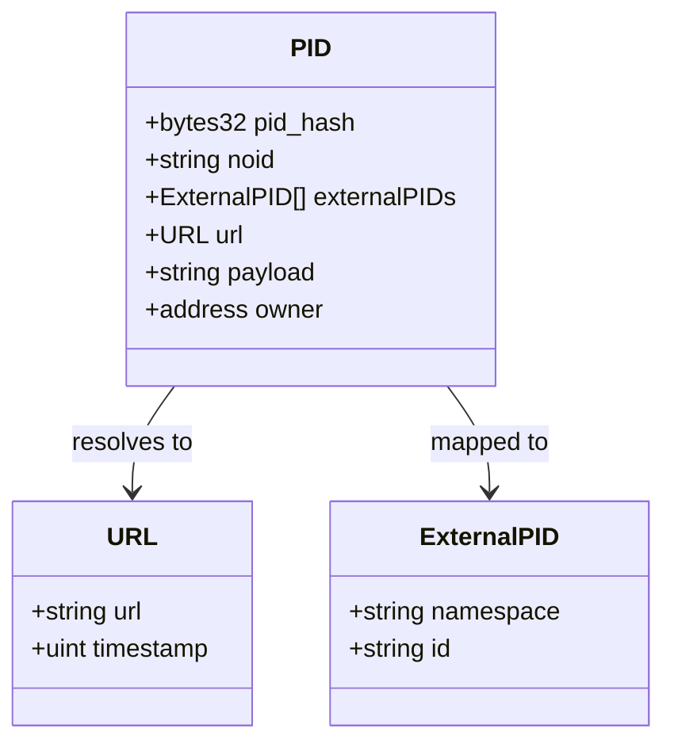
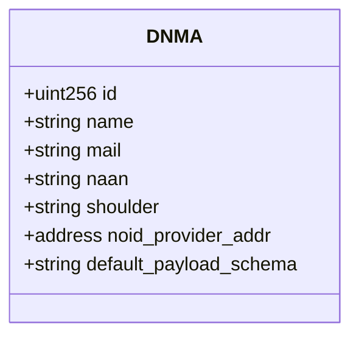
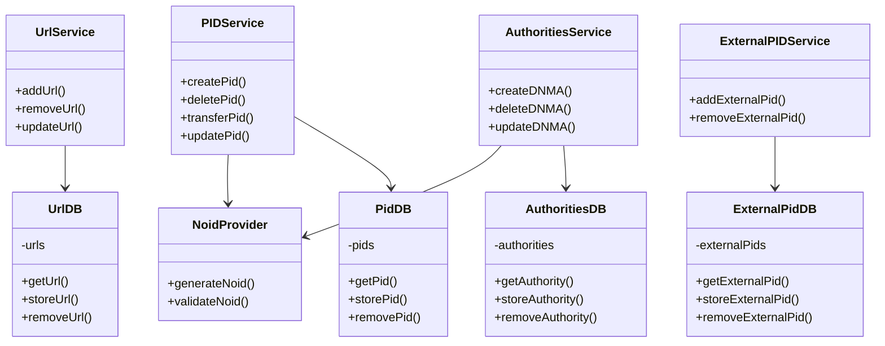
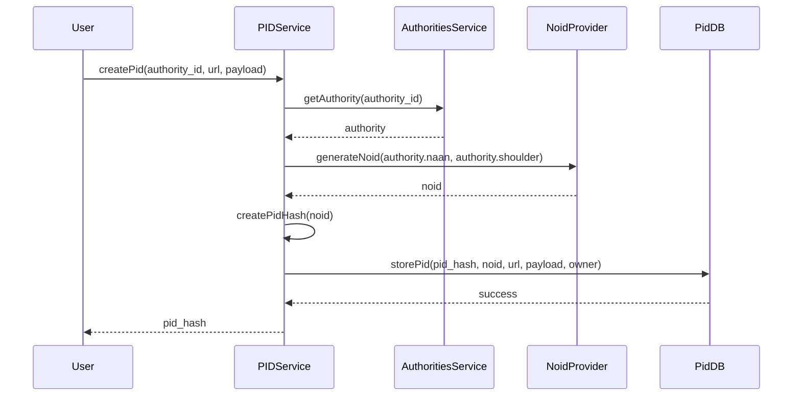
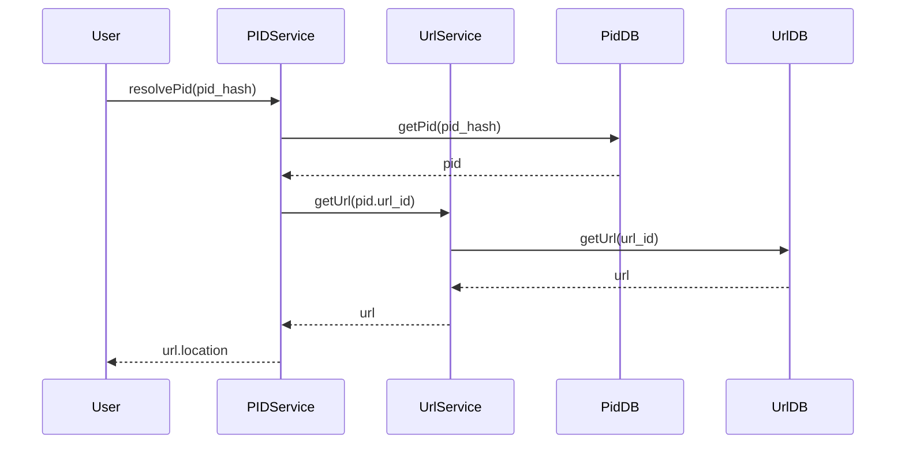

# dARK Implementation Details

This document provides a detailed overview of the dARK system's on-chain implementation, focusing on its core components, data models, and smart contract architecture.  It describes how the system functions at a technical level, outlining the interactions between different contracts and the data structures they manage.

This document is structured as follow:

- [Core Components and Data Models](#core-components-and-data-models)
- [Smart Contract Details](#smart-contract-details)
- [Smart Contract Architecture](#smart-contract-architecture)
- [dARK Key Processes](#dark-key-processes)

## Core Components and Data Models

The dARK system is built around a few key components and data models, all implemented and managed on the blockchain:

### 1. Persistent Identifier (PID)

The central entity in the dARK system is the Persistent Identifier (PID), which represents a registered resource.  Each PID is designed to be globally unique and persistent over time.

- `pid_hash`: A unique, fixed-size hash of the NOID, serving as the primary key for the PID within the dARK system. Using a hash ensures efficient storage and lookup.

- `noid`: The Nice Opaque Identifier (NOID) portion of the ARK identifier.  This is a human-readable (though opaque) string that is generated by the NoidProvider.

- `externalPIDs`: An array of ExternalPID objects. This allows a dARK PID to be mapped to identifiers from other PID systems (like DOIs, ORCIDs, etc.), promoting interoperability.

- `url`:  A URL object representing the current location of the resource associated with the PID. The use of a dedicated URL object allows for tracking URL changes over time.

- `payload`:  The metadata associated with the resource, stored as a string.  The specific format of the payload is determined by a schema (defined elsewhere, typically in the config.ini file).  While smaller payloads can be stored directly on-chain, larger payloads might be stored off-chain (e.g., in IPFS), with only the hash of the payload stored on-chain for verification.

- `owner`: The blockchain address of the entity that owns the PID.  This is typically the address of the curator who registered the PID.

### 2. Decentralized Name Mapping Authority (DNMA)

DNMAs are the authorities within the dARK system that are permitted to mint new PIDs. They represent institutions or organizations that have been granted the right to register resources and assign ARK identifiers.

- `id`: A unique numerical identifier for the DNMA.
- `name`: The human-readable name of the DNMA (e.g., "University of Example").
- `mail`:  A contact email address for the DNMA.
- `naan`: The Name Assigning Authority Number (NAAN) assigned to the DNMA. This part of the ARK identifier structure, ensuring global uniqueness. Defined by the ARK aliance.
- `shoulder`:  A prefix used within the NAAN to further subdivide the namespace (e.g., for different departments within a university).
- `noid_provider_addr`: The blockchain address of the NoidProvider contract used by this DNMA. This allows for different DNMAs to potentially use different NOID generation algorithms (though in most cases, a single, shared NoidProvider would be used).
- `default_payload_schema`: The name of the default metadata schema used by this DNMA when minting new PIDs.

### 3. NOID Provider

The NOID (Nice Opaque Identifier) provider is responsible to provide a unique string based on a given configuration. Further detail in the following [repository](https://github.com/projetos-codic-ibict/dark-algorithms/).

## Smart Contract Details

This section provides details about the individual smart contracts that make up the dARK system. The contracts are grouped into:

- [Services Contracts](#services)
- [Database Contracts](#databases)
- [Utility Contracts](#utility-contracts)

In the folowing we explain de key functions of the each group.

### Services

These contracts provide the main functionalities of the dARK system:

#### 1. PIDService.sol

This service is the primary interface for managing PIDs. It handles the creation, updating, deletion, and resolution of PIDs.

**Key Functions:**

*   **`createPid(authority_id, url, payload)`:** Creates a new PID, as illustrated in the PID Creation Process diagram. It interacts with the `AuthoritiesService`, `NoidProvider`, and `PidDB` contracts.
*   **`updatePid(pid_hash, url, payload)`:** Updates the URL and/or payload of an existing PID. This function would typically include checks to ensure that only the owner of the PID (or an authorized entity) can perform the update.
*   **`deletePid(pid_hash)`:** Deletes a PID. This function would also typically include strict permission checks. In a real-world implementation, you might prefer to *deactivate* a PID rather than completely deleting it, to maintain a historical record.
*   **`transferPid(pid_hash, new_owner)`:** Transfers ownership of a PID to a different blockchain address.
*   **`resolvePid(pid_hash)`:** Resolves a PID to its associated URL, as illustrated in the PID Resolution Process diagram. It interacts with the `PidDB` and `UrlService` contracts.

#### 2. UrlService.sol

Manages the URLs associated with PIDs. This allows for tracking URL changes over time.

**Key Functions:**

*   **`addUrl(pid_hash, url)`:** Associates a new URL with a PID.
*   **`updateUrl(pid_hash, url_id, new_url)`:** Updates an existing URL associated with a PID.
*   **`removeUrl(pid_hash, url_id)`:** Removes a URL association.

#### 3. ExternalPIDService.sol

Handles mappings between dARK PIDs and identifiers from external PID systems (e.g., DOIs, ORCIDs). This facilitates interoperability with other systems.

**Key Functions:**

*   **`addExternalPid(pid_hash, namespace, id)`:** Adds a mapping between a dARK PID and an external PID. The `namespace` parameter indicates the external PID system (e.g., "doi", "orcid").
*   **`removeExternalPid(pid_hash, ext_pid_id)`:** Removes a mapping to an external PID.

#### 4. AuthoritiesService.sol

Manages the DNMAs (authorities) that are permitted to mint new PIDs.

**Key Functions:**

*   **`createDNMA(name, mail, naan, shoulder, noid_provider)`:** Creates a new DNMA. This function would typically be restricted to a system administrator or a designated governance contract.
*   **`updateDNMA(id, name, mail, naan, shoulder, noid_provider)`:** Updates the information associated with a DNMA.
*   **`deleteDNMA(id)`:** Removes a DNMA. This would also likely be a restricted function.

### Databases

These contracts are responsible for storing the data of the dARK system. They act as on-chain databases, providing functions for storing, retrieving, and removing data. Separating the data storage from the service logic enhances modularity and makes it easier to upgrade the system.

#### 1. `PidDB.sol`

Stores the core PID data.

**Key Functions:**

*   **`storePid(pid_hash, noid, url, payload, owner)`:** Stores a new PID record.
*   **`getPid(pid_hash)`:** Retrieves a PID record by its `pid_hash`.
*   **`removePid(pid_hash)`:** Removes a PID record.

#### 2. `UrlDB.sol`

Stores URL data associated with PIDs.

**Key Functions:**

*   **`storeUrl(url)`:** Stores a new URL.
*   **`getUrl(url_id)`:** Retrieves a URL by its ID.
*   **`removeUrl(url_id)`:** Removes a URL.

#### 3. `ExternalPidDB.sol`

Stores mappings between dARK PIDs and external PIDs.

**Key Functions:**

*   **`storeExternalPid(pid_hash, namespace, id)`:** Stores a mapping to an external PID.
*   **`getExternalPid(ext_pid_id)`:** Retrieves a mapping by its ID.
*   **`removeExternalPid(ext_pid_id)`:** Removes a mapping.

#### 4. `AuthoritiesDB.sol`

Stores information about the DNMAs (authorities).

**Key Functions:**

*   **`storeAuthority(name, mail, naan, shoulder, noid_provider)`:** Stores a new DNMA record.
*   **`getAuthority(id)`:** Retrieves a DNMA record by its ID.
*   **`removeAuthority(id)`:** Removes a DNMA record.

### Utility Contracts

These contracts provide supporting functionalities:

#### 1. `NoidProvider.sol`

Generates NOIDs (Nice Opaque Identifiers) according to the NOID specification. This contract ensures that generated NOIDs are unique and verifiable.

**Key Functions:**

*   **`generateNoid(naan, shoulder)`:** Generates a new NOID, incorporating the provided NAAN and shoulder to ensure uniqueness within the dARK system. The specific algorithm for NOID generation would be implemented within this function (e.g., using a counter, a random number generator with appropriate collision checks, or a combination).
*   **`validateNoid(noid)`:** Validates a NOID using its check digit (if the NOID scheme includes a check digit). This helps to prevent errors caused by typos or incorrect NOID entry.

#### 2. `UUIDProvider.sol`

Provides an alternative mechanism for generating unique identifiers, using UUIDs (Universally Unique Identifiers). This could be used as a fallback or alternative to NOIDs, or for internal identifiers within the system. *This is less central to the ARK functionality but might be useful in certain scenarios.*

#### 3. `Entities.sol`

This contract (or library) defines the data structures (structs) used throughout the dARK system, such as `PID`, `URL`, `ExternalPID`, and `DNMA`. Centralizing these definitions promotes consistency and makes it easier to modify the data models if needed. This is a *very important organizational practice* for Solidity development.

## Smart Contract Architecture

This section presents a class diagram illustrating the relationships between the various dARK smart contracts.  This provides a visual overview of how the different parts of the system interact.

This diagram shows the dependencies between the service contracts, the database contracts, and the NoidProvider. For example, the PIDService depends on the PidDB (to store and retrieve PID data) and the NoidProvider (to generate NOIDs). This separation of concerns improves the maintainability and upgradeability of the system.

## dARK Key Processes

These sequence diagrams illustrate the typical flow of interactions within the dARK system for common operations:

### 1. PID Creation Process
This diagram shows the steps involved in creating a new dARK PID:

1. User requests PID creation: A user (typically a curator or an application acting on behalf of a user) initiates the process by calling the createPid function of the PIDService contract, providing the ID of the responsible authority, the URL of the resource, and the metadata payload.

2. PIDService retrieves authority information: The PIDService calls the getAuthority function of the AuthoritiesService to retrieve the details of the specified authority. This ensures that the requesting user has the necessary permissions and that the authority exists.

3. NoidProvider generates NOID: The PIDService calls the generateNoid function of the NoidProvider contract, passing the NAAN and shoulder of the authority. The NoidProvider generates a unique NOID.

4. PIDService creates PID hash: The PIDService creates a unique hash (pid_hash) from the generated NOID. This hash serves as the primary key for the PID.

5. PidDB stores PID: The PIDService calls the storePid function of the PidDB contract, storing the pid_hash, noid, URL, payload, and the owner's address.

6. PIDService returns PID hash: The PIDService returns the pid_hash to the user, confirming the successful creation of the PID.

### 2. PID Resolution Process

This diagram shows how a dARK PID is resolved to its associated URL:

1. User requests resolution: A user (or an application) initiates the resolution process by calling the resolvePid function of the PIDService, providing the pid_hash.
1. PIDService retrieves PID: The PIDService calls the getPid function of the PidDB to retrieve the PID data associated with the given pid_hash.
1. PIDService retrieves URL: The PIDService extracts the url_id from the retrieved PID data and calls the getUrl function of the UrlService.
1. UrlService retrieve URL information: The UrlService call the getUrl function of the UrlDB contract to get the URL value.
1. PIDService returns URL: The PIDService returns the URL location to the user.
